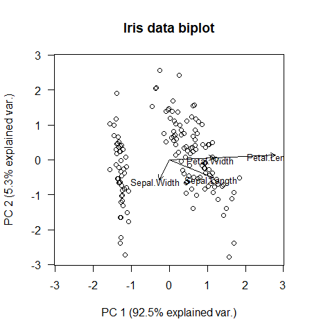
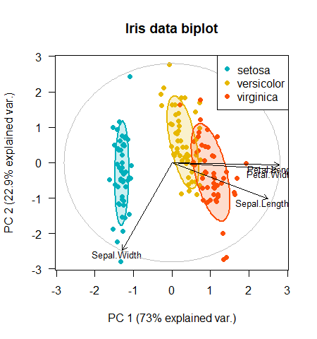

# pca.biplot
The aim of this project was to make a simple to use customizable correlational biplot function, where R's default packages are used as much as possible. Principal components are scaled to unit variance.
Now also includes a 3D biplot function.

## Contents:
* pca.screeplot: Plots the percentage of explained variance against the number of the principal component.
* pca.biplot:    A customizable correlational 2D biplot function.
* pca.biplot3d:  Make an interactive 3D biplot.

## Installation
``` r
library(devtools)
install_github("StefaanVerwimp/Biplot")
```
Or download the R files locally and load them in using the function:
``` r
# Choose r-files
source(choose.files())
```

## Example Usage
The simplest biplot:
```r
data(iris)
library(pca.biplot)
pca.biplot(iris[,-5])
```

<p align="center">
  
</p>

With some customization:
```r
pca.biplot(iris[,-5], scale = T, col = c("#00AFBB", "#E7B800", "#FC4E07"),
           groups = iris$Species, ellipse = T, pch = 16, main = "Iris data biplot",
           legend.pos = 'topright', circle.options = list(border = "grey"))
```

<p align="center">
  
</p>


In 3D:
```r
pca.biplot3d(iris[,-5], groups = iris$Species, scale = T, box = T, grid = T, ellipse = T)
```

<p align="center">
  
</p>